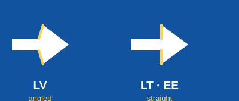

# Latvia · Lithuania · Estonia

**Direction sign arrows** — unique for LV. All three use white arrows on blue signs; the split is
where the barb meets the shaft.

| | Shaft → barb |
|---|---|
| **LV** | **angled**, slants back diagonally |
| LT · EE | straight, square to the shaft |

Splits LV off. For LT vs EE use the letters.

## Letters on place names

| | Give-away | Endings |
|---|---|---|
| **LV** | macrons **ā ē ī ū**, cedillas **ģ ķ ļ ņ** | -s, -a |
| **LT** | **ė**, ogoneks **ą ę į ų** | -as, -is, -us |
| **EE** | **õ ä ö ü**, doubled letters (Ta**ll**i**nn**) | – |

`ė` and `õ` are each unique to one country. Neither LV nor EE uses `ė`; only EE uses `õ`.
